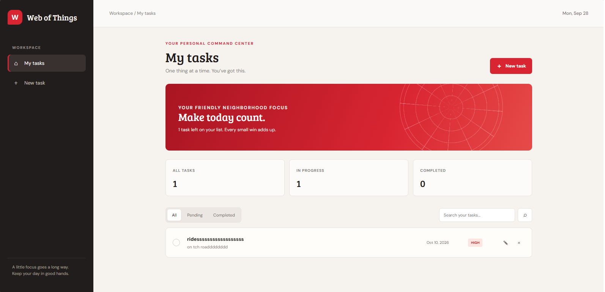
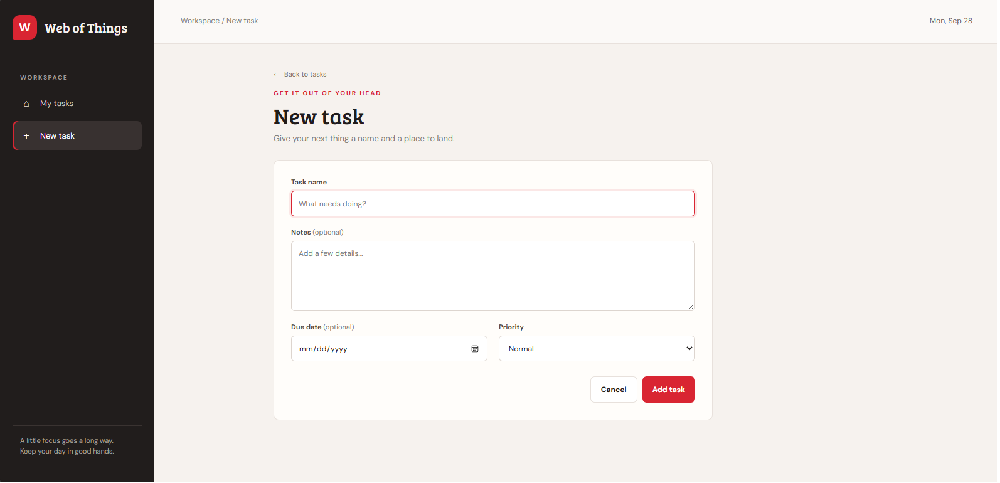
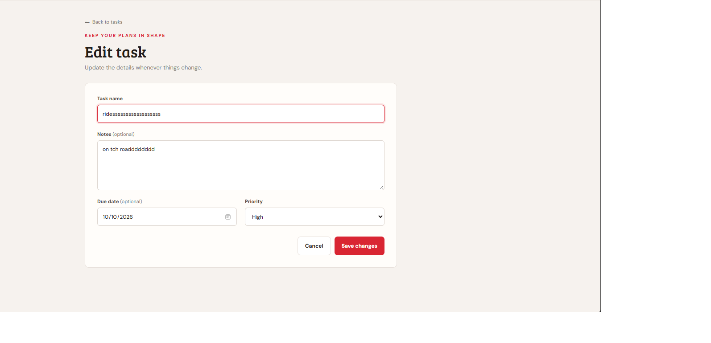
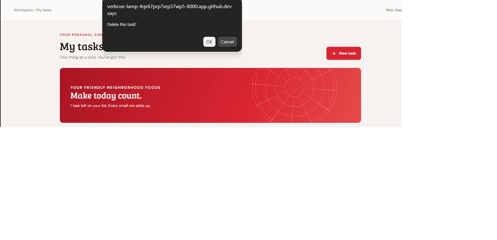

# Personal Task Manager

Project Code: WST21-PM-2026-SF
Student Name: Visnuh Miguel F. Sadaya 
Course & Year: BSIT-2 
Database Used: SQLite 

## Features

- Add Task
- View Tasks
- Edit Task
- Delete Task
- Update Status

## Screenshots and Step-by-Step Guide

### Step 1: Open the task dashboard

The dashboard shows your task list and a summary of all, in-progress, and completed tasks. Select **New task** to add an item, or use the filters and search field to find an existing task.

### Step 2: Add a task

On the new-task form, enter a task name. You can also add notes, choose a due date, and set a priority. Select **Add task** to save it and return to the task list.

### Step 3: Review and update task status

Find the task in the list and review its due date and priority. Use the checkbox beside it to mark it completed; select it again to return it to pending. The dashboard totals update to reflect the status.

### Step 4: Edit task details

Select the edit control for a task to change its name, notes, due date, or priority. Choose **Save changes** to keep the updates. From the task list, you can also use the delete control to remove a task after confirming the prompt.